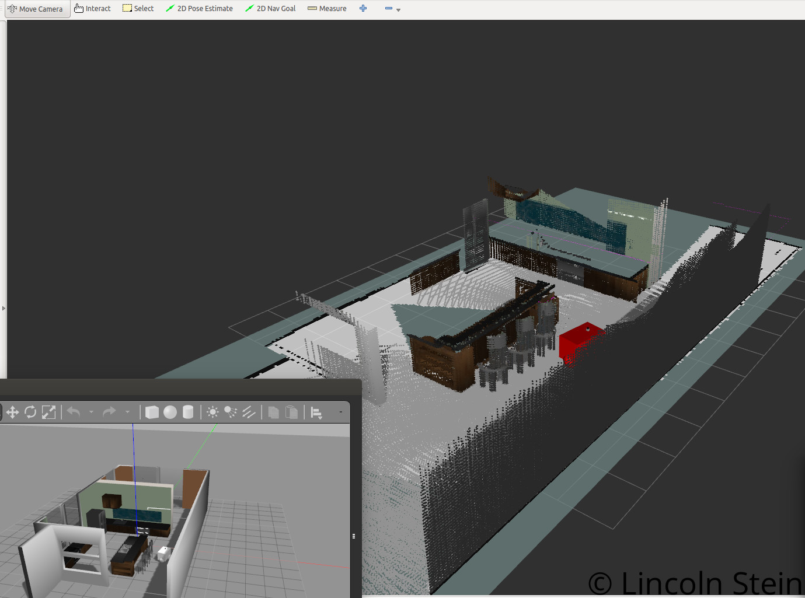

# RSEND_Slam_Project
Code and documentation related to Udacity Robotics Software Engineer Nanodegree SLAM Project. Below is a brief overview, more information can be found within the report [directory](Mapping_Project_Report/RSEND_Mapping_Project_Report.pdf)

## Background
This project is designed to create a robot that can perform Simultaneous Localization and Mapping within a simulated environment. The ability to generate a map and localize within that map is key to allowing robots to operate in dynamic environments. This project focuses on creating a ROS package that implements SLAM and tests it within two Gazebo environments. The components can be reused for further research, such as testing robot designs, sensor configurations, and different environments to observe the impact on SLAM performance.

## Usage
This project is built within the ROS framework and utilizes Gazebo. The ROS website and many other locations can help you get the basic environment set up. 

In order to see this project, you will need to copy the slam_project directory into your catkin_ws/src directory

Next install missing dependencies using rosdep install:

$ cd ~/catkin_ws
$ rosdep install --from-paths src --ignore-src --rosdistro=kinetic -y

Build the project:

$ cd ~/catkin_ws
$ catkin_make

Then, you will need to execute the rtab_run script within the slam_project/src directory. Following the prompts and accepting defaults will launch the robot and gazebo environment. Using the teleop node, you can control the robot and observe the mapping in the RVIZ window. 

An example of the output you should see is below. The bottom left shows the gazebo simulation environment and the larger image shows the generated map displayed in RVIZ after driving the robot around the environment manually.

